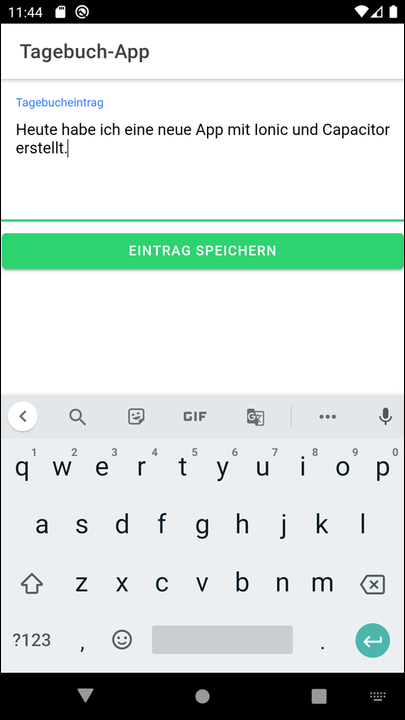
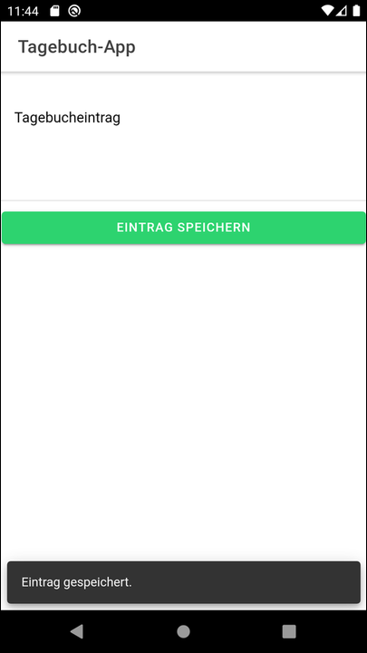

# Ionic app to demonstrate usage of a Capacitor plugin #

The repository contains an Ionic app for Android which is a very simple diary app.
All texts entered are written into a text file on the filesystem of the Android device,
for which the Capacitor plugin [filesystem](https://capacitorjs.com/docs/v3/apis/filesystem)
is used, see also [here](https://www.npmjs.com/package/@capacitor/filesystem).

<br>

----

## Screenshots ##

  

<br>

----

## Adding the plugin ##

Update to capacitor 3.x if needed (see also [here](https://capacitorjs.com/docs/v3/updating/3-0)):
```
npm install @capacitor/cli@next @capacitor/core@next
```

<br>

Adding the plugin to the project:
```
npm install @capacitor/filesystem
npx cap sync
```

<br>

Get list of project's plugins:
```
npx cap ls android
```

<br>

----

## Entries needed in Manifest file of Android application ##

For using the plugin `filesystem` in the app the following things in the [Manifest file](android/app/src/main/AndroidManifest.xml) have to be changed:

Allowing access to folder `Documents` as of Android 10:
```
android:requestLegacyExternalStorage="true"
```

Declaring permission:
```
<uses-permission android:name="android.permission.WRITE_EXTERNAL_STORAGE" />
```

<br>

----

## Text editor app ##

The following app can be used to open the text file created by this app: 
https://f-droid.org/de/packages/org.billthefarmer.editor/

<br>

----

## Using Live Reload ##

Ensure that NPM module [native-run](https://www.npmjs.com/package/native-run) is installed globally.
If it is not installed, then you can install it using the following command:
```
npm install -g @ionic/cli native-run
```

<br>

For using *Live Reload* you then have to call the following command (*Android Studio* should be running but no project opened when entering this command):
```
ionic cap run android -l --external
```
At startup of this command you will have to select a local IP address.
After this the project will be opened in *Android Studio*.
Start the app in the emulator by clicking on the "Run" button in *Android Studio*.

<br>

When you now save a changed file of the Ionic application, then the app in the emulator will be refreshed and uses the changed file(s) afterwards.

<br>

----

## License ##

See the [LICENSE file](LICENSE.md) for license rights and limitations (BSD 3-Clause License) for the files in this repository.

<br>